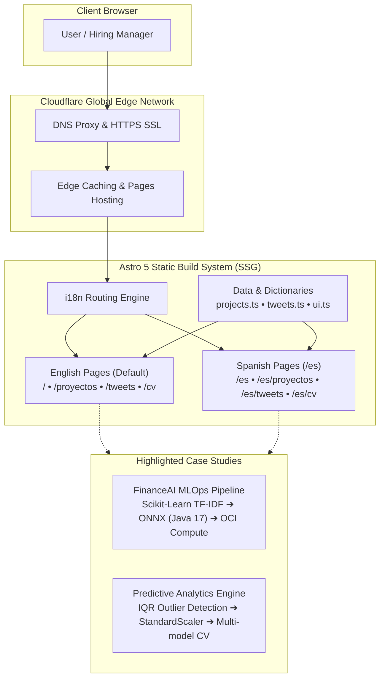

<div align="center">

# 🚀 Christian Quidel — Data Science Portfolio & Technical Showcase

[](https://astro.build)
[](https://www.typescriptlang.org/)
[](https://tailwindcss.com)
[](https://www.chartjs.org)
[](https://quidelchristian.com.ar)
[](LICENSE)

**A high-performance personal portfolio, technical case study hub, and microblogging platform built with a Global-First architecture for international Data Science and MLOps recruitment.**

[Explore Live Demo](https://quidelchristian.com.ar) • [Versión en Español](https://quidelchristian.com.ar/es) • [Connect on LinkedIn](https://linkedin.com/in/quidelchristian) • [Follow on X](https://x.com/CDanqui)

</div>

---

## 📌 Overview

This repository contains the complete source code for my personal portfolio and engineering showcase. Designed to bridge **clinical diagnostic rigor** (from a prior hospital healthcare background in ICU and Neonatology) with **production-ready Machine Learning and MLOps engineering**, the platform emphasizes:

1. **⚡ Sub-Second Static Performance:** Built with Astro static-site generation (SSG) with zero runtime JS by default (100/100 Lighthouse performance).
2. **🌐 First-Class Bilingual Internationalization:** Native bilingual routing (`/` for English, `/es` for Spanish) with smooth switcher and SEO OpenGraph tags.
3. **📊 Interactive MLOps Benchmarks:** Empirical Chart.js visualization comparing sub-millisecond ONNX in-memory inference (< 0.8ms) against traditional Python REST API latency.
4. **📄 Single-Page ATS-Optimized Resume:** Integrated, printable single-page resume ready for PDF export.

---

## 🏛️ System Architecture



---

## 🛠️ Tech Stack & Design System

| Layer | Technology | Purpose |
| :--- | :--- | :--- |
| **Framework** | [Astro 5](https://astro.build/) | Static Site Generation (SSG), Islands Architecture, zero JS baseline |
| **Language** | [TypeScript](https://www.typescriptlang.org/) | Type-safe data models for projects, metrics, and bilingual dictionaries |
| **Styling** | [Tailwind CSS](https://tailwindcss.com/) | *Office Corporate* design tokens (Slate `#0f172a`, Blue `#2563eb`, Inter font) |
| **Data Viz** | [Chart.js](https://www.chartjs.org/) | Responsive canvas for empirical inference latency comparisons |
| **Deployment** | [Cloudflare Pages](https://pages.cloudflare.com/) | Global CDN deployment with automated CI/CD and edge SSL |

---

## 🌟 Featured Engineering Case Studies

### 1. [FinanceAI](https://github.com/reddjedet) — Intelligent Financial Diagnostic & NLP Platform
* **Domain:** Natural Language Processing (NLP) & Cross-Language MLOps.
* **Core Achievement:** Classified 240,000+ financial transaction records across 10 classes with **99.0% test accuracy** using Scikit-Learn TF-IDF vectorization.
* **MLOps Highlight:** Serialized pipelines to **ONNX format (`skl2onnx`)** for native in-memory execution inside a **Java 17 / Spring Boot** backend, reducing latency to **< 0.8ms** (a 98.2% latency reduction compared to external Python REST APIs).
* **Cloud Architecture:** Orchestrated 4 microservices (Vue 3, Spring Boot, MySQL, Jupyter) using Docker Compose on Oracle Cloud Infrastructure (OCI Compute).

### 2. [Predictive EDA Engine](https://github.com/reddjedet) — Tabular Preprocessing & Anomaly Detection
* **Domain:** Exploratory Data Analysis (EDA) & Supervised Learning.
* **Core Achievement:** Modular preprocessing pipeline with IQR outlier detection, automated feature scaling, and multi-model benchmark evaluation (Logistic Regression vs. Decision Trees with 5-Fold Cross Validation).

---

## 💻 Local Development

### Prerequisites
* **Node.js** `>= 18.14.1`
* **npm** `>= 9.0.0`

### Quick Start
```bash
# 1. Clone the repository
git clone https://github.com/reddjedet/mi-pagina.git
cd mi-pagina

# 2. Install dependencies
npm install

# 3. Start local development server (http://localhost:4321)
npm run dev

# 4. Compile static assets for production (dist/)
npm run build

# 5. Preview production build locally
npm run preview
```

---

## 🛡️ Security & Privacy Perimeter

* **Zero Hardcoded Credentials:** No API keys, database connection strings, or cloud tokens are tracked in git.
* **Privacy Blinded:** No government IDs (DNI/CUIT), street addresses, or private filesystem paths exist in the codebase.
* **Strict Git Hygiene:** Production builds (`dist/`), dependencies (`node_modules/`), and environment files (`.env*`) are excluded.

---

## 👨‍💻 Author & Contact

**Christian Quidel**  
*Data Scientist Trainee • MLOps • Python & Cloud Architecture*

* 📍 **Location:** Buenos Aires, Argentina (Open to Remote | UTC-3)
* 💼 **LinkedIn:** [linkedin.com/in/quidelchristian](https://linkedin.com/in/quidelchristian)
* 🐙 **GitHub:** [@reddjedet](https://github.com/reddjedet)
* 🐦 **X (Twitter):** [@CDanqui](https://x.com/CDanqui)
* 📧 **Email:** [quidelchristian@gmail.com](mailto:quidelchristian@gmail.com)

---

## 📄 License
This project is open-source and licensed under the [MIT License](LICENSE).
